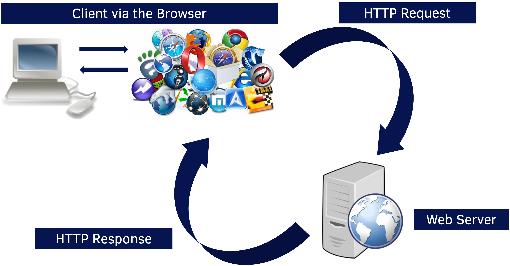
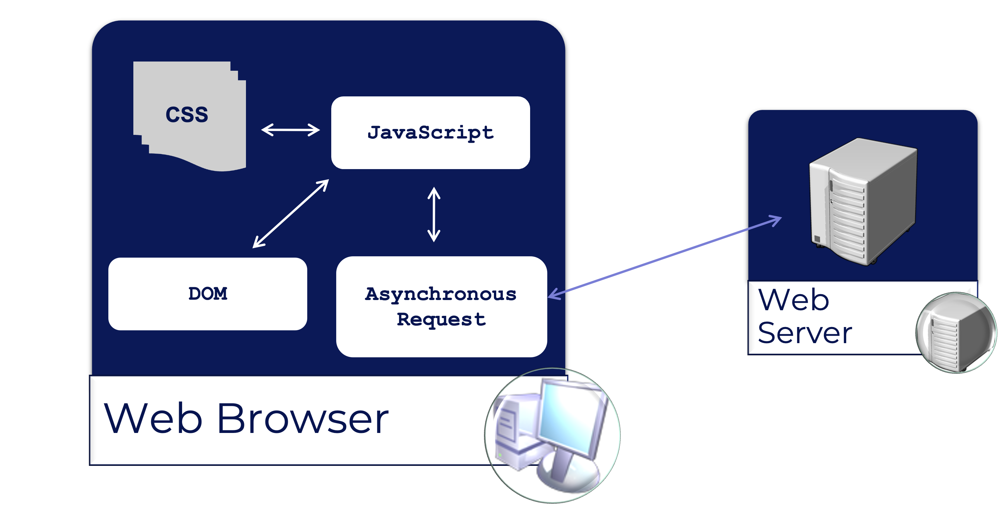
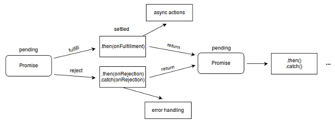
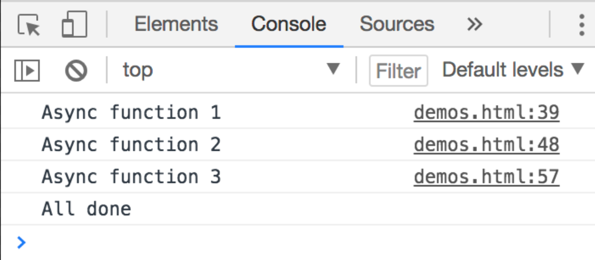

- To understand what HTTP Verbs are used in RESTful services
- To be able to use Asynchronous JavaScript
- To be able to set up a mock RESTful service
- To be able to get data from an external service in Vanilla JavaScript
- To be able to send data to an external service in Vanilla JavaScript

## Contents

- Making asynchronous HTTP requests
  - Installing a mock server
  - Using `axios` as a 
  - Stopping cyclic requests in `useEffect`
  - 

---

## HTTP Requests and Responses



### HTTP Request Structure

HTTP Requests have:
  - Request Line
  - Zero or more header fields followed by CRLF \(\\r\\n\)
  - An empty line \(CRLF\) indicating the end of the header fields
  - An optional message body \(ie\.\, data / content\)

```
POST /php/myapplication.php HTTP/1.1
User-Agent: Mozilla/4.0 (compatible; MSIE5; Windows NT)
Host: www.example.com
Content-Type: application/x-www-form-urlencoded
Content-Length: length
Accept-Language: en-us
Accept-Encoding: gzip, deflate
Connection: Keep-Alive

key=value&username=example&email=me@example.com
```

### HTTP Response Structure

HTTP Responses have:
  - a status line
  - Zero or more header fields followed by CRLF \(\\r\\n\)
  - An empty line \(\\r\\n\)
  - An optional message body\(data\, content\)

```
HTTP/1.1 200 OK
Date: Mon, 21 Mar 2016 09:15:56 GMT
Server: Apache/2.2.14 (Win32)
Last-Modified: Mon, 21 Mar 2016 09:14:01 GMT
Content-Length: 88
Content-Type: text/html
Connection: Closed

<html>
<body>
<h1>Hello, World!</h1>
</body>
</html>
```

### HTTP Verbs

Most Common:
- __GET__ \-\- Retrieve information for a given URI
- __POST__ \-\- Send data to the given URI
- __PUT__ \-\- Replace data at the given URI
- __DELETE__ \-\- Remove data at the given URI

Rarely used:
- HEAD
- OPTIONS
- TRACE


#### Example GET Request

```
GET /index.php HTTP/1.1
User-Agent: Mozilla/4.0 (compatible; MSIE5; Windows NT)
Host: www.example.com
Accept-Language: en-us
Accept-Encoding: gzip, deflate
Connection: Keep-Alive
```

#### Example DELETE Request

```
DELETE /users/id/1012 HTTP/1.1
User-Agent: Mozilla/4.0 (compatible; MSIE5; Windows NT)
Host: www.example.com
```

### GET Requests

GET requests have no request body
- The URI specifies most of the data the server requires
  - The protocol, eg. `HTTP`
  - The host, eg. `example.com`
  - The resource location, eg. `/index.php`
  - The query string, eg. `?username=eg&email=foo@example.com`
  - The query string contains associative key/value pairs
    - Technically limited to 255 characters however in practice they can be over 1000 long
- Other information can be supplied with headers, either standard ones or custom headers typically preceded by `X-`

### POST Requests

- POST requests _build on_ GET requests by including a message body
  - They can use the query string system _and_ the message body to send data
  - Larger or more sensitive information is usually sent via POST
    - The message body can have a practically unlimited size \(usually limited by what the server will accept\,eg\. 20MB\)
    - The browser sends the POST body "behind the scenes" whereas the URL is visible in the address bar
- POST messages are _not_ more secure than GET messages however
  - Both are sent "plain text" over the network
- Use HTTPS for encryption

### HTTP Status Codes

| Status Code Pattern | Pattern Family | Example | Example Meaning       | Example Information                        |
| ------------------- | -------------- | ------- | --------------------- | ------------------------------------------ |
| 1\*\*               | Informational  | 102     | Processing            | Processing still going on                  |
| 2\*\*               | Successful     | 201     | OK                    |                                            |
| 3\*\*               | Redirection    | 301     | Moved Permanently     | Resource has moved to a different location |
| 4\*\*               | Client Errors  | 404     | Not Found             | The requested resource could not be found  |
| 5\*\*               | Server Errors  | 500     | Internal Server Error | A problem with the responding server       |

---

## Asynchronous JavaScript

### Overview

  - What is Asynchronous JavaScript?
  - Asynchronous JavaScript-enabling technologies
  - Client and Server architecture
  - JSON
  - Promises
  - The Fetch API
  - Async/Await

### What is asynchronous JavaScript?

- A methodology for creating rich Internet applications
  - Used to create highly-responsive applications
  - Rich content and interactions
- A client-focused model
  - Uses client-side technologies – JavaScript, CSS, HTML
- A user-focused model
  - Asynchronous behaviour based on user interactions
  - User-first’ development model
- An asynchronous model
  - Communications with the server are made asynchronously
  - User activity is not interrupted

### Four principles of asynchronous JavaScript

- The browser hosts an application
  - A richer document is sent to the browser
  - JavaScript manages the client-side interaction with the user
- The server delivers data
  - Requests for data - not content - are sent to the server
  - Less network traffic and greater responsiveness
- User interaction can be continuous and fluid
  - The client is able to process simple user requests
  - Near instantaneous response to the user

---

## Asynchronous JavaScript - enabling technologies

**CSS**, **DOM**, **JavaScript** and an **Asynchronous Request API**



The diagram above shows the main enabling technologies of Asynchronous JavaScript.  

At the client end, we have the web browser, which will host the document that is requested. This document is made available via a Document Object Model (DOM), so that we can programmatically manipulate the document using JavaScript and also hook into the events of the browser, document and constituent elements.

In addition, we can use an Asynchronous Request API to initiate requests to a server in order to retrieve data, then use that data through JavaScript to update the document through the DOM.

---

## JavaScript Object Notation (JSON)

- Lightweight data-interchange format
  - Compared to XML
- Simple format
  - Easy for humans to read and write
  - Easy for machines to parse and generate
- JSON is a text format
  - Programming language independent
  - Conventions familiar to programmers of the C-family of languages, including C# and JavaScript
- Universal data structures supported by most modern programming languages
- A collection of name/value pairs
  - Realised as an object (associative array)
- An ordered list of values
  - Realised as an array
- JSON object
  - Unordered set of name/value pairs
  - Begins with { (left brace) and ends with } (right brace)
  - Each name followed by a : (colon)
  - Name/Value pairs separated by a , (comma)

```json
{
  "results": [
    {
      "home": "React Rangers",
      "homeScore": 3,
      "away": "Angular Athletic",
      "awayScore": 0
    },
    {
      "home": "Ember Town",
      "homeScore": 2,
      "away": "React Rangers",
      "awayScore": 2
    }
  ]
}
```

JSON consists of structures that are supported by most modern programming languages and so is immediately accessible to most.

It is an associative array (name/value pairs) and can contain an ordered list of values as an array.

The overall JSON object consists of an unordered list of name/value pairs contained within curly braces with each name and value pair separated by a colon and the name/value pairs separated by a comma.

### JSON and JavaScript

- JSON is a subset of the object literal notation of JavaScript.
  - Can be used in the JavaScript language with no problems

```js
let myJSONObject = {
    "searchResults": [
        { 
            "productName": "Aniseed Syrup", 
            "unitPrice": 10 
        }, 
        { 
            "productName": "Alice Mutton", 
            "unitPrice": 
            39 
        }
    ]
};
```

JSON is a subset of the object-literal notation of JavaScript and so can be used (as shown above) in JavaScript with no problems.

The object realised in the above example can be accessed using either dot or subscript operators as shown in the second example.

### The JSON Object (as defined in ECMAScript)

- The JSON object is globally available
  - The __parse__ method takes a string and parses it into JavaScript objects

```js
let obj = JSON.parse('{"name":"Adrian"}');
console.log(obj.name); //returns Adrian
```

  - The __stringify__ method takes JavaScript objects and returns a string
    - This is good when you need to send a JSON object in something other than JSON!
- Makes working with JSON data a trivial affair

```js
let str = JSON.stringify({ name: "John" });
console.log(str)// returns `{name}: "John"}` (without the back-ticks)
```

---

## RESTful APIs

- Default data source for most Web and mobile applications
- REST stands for Representational State Transfer
  - Lightweight
  - Maintainable
  - Scalable
- Not dependent on any protocol
  - Most use HTTP or HTTPS as the underlying protocol
- Can be made to provide data in JSON \(desirable for JS applications\) or XML
- Make a request to a URL – can CRUD
    - Create
    - Read
    - Update
    - Delete

### JSON Server

- Developing a solution that needs a RESTful API can be troublesome if the service is not available
- [JSON Server](https://www.npmjs.com/package/json-server
) is:
  
> _a full fake REST API with_  _zero\-coding_  _in_  _less than 30 seconds_  _\(seriously\)_ ”

- Essentially needs:
  - A properly\-formed JSON file for the data
  - An npm installation \(either global or local\)

```sh
npm i -g json-server
```

- Once installed\, point JSON server at your __\.__  __json__ file
- By default it runs on port 3000 – change this by adding a __`–p \<PORT\_NO>`__ to the command to open

```
json-server /path/to/file/filename.json -p 4000
```

- If you have a JSON file as shown below, access is by using the format:

```
http://localhost:port/arrayName/objectId
```

- You can use any type of HTTP verb request:
  - GET
  - POST
  - PUT
  - UPDATE
  - DELETE
- The JSON file is modified by requests to do so
  - id is immutable and auto-generated

```json
{
  "posts": [
    {"id": 1, "title": "json-server" }
  ],
  "comments": [
    {"id": 1, "body": "comment", "postID": 1}
  ],
  "profile": {"name": "typicode" }
}
```

So a request to: `http://localhost:3000/posts/1` would yield:

```json
{"id" : 1, "title": "json-server" }
```

The command line running json-server needs to be kept open and running for the duration of your development work.  `CTRL + C` will terminate the server and it would have to be restarted to provide data again.

### Using a different id than id

If you data set uses a property other than `id` as it's unique identifier, JSON-Server can handle this too!

In the command to run the server, use the switch `--id` and then the name of the unique identifier in each object.

For example, if our sample data set uses `_id` as a unique identifier and we wanted to run the server on port 4000 (because React wants to use port 3000), the command would be:

```sh
json-server /path/to/file/filename.json -p 4000 --id _id
```
---

### Activity 16a - GROUP ACTIVITY - Install JSON Server

Install JSON Server globally

Use the file sampleTodos.json from ExternalData/starter to provide tododata from a fake RESTful service, do this:
 
 - On port 4000
 - Using _id as a unique identifier

Check that you can access the data in the browser by navigating to:

`http://localhost:4000/todos`

Check you can access an individual todo by navigating to:

`http://localhost:4000/todos/5cc08495bf3fd62d03f2f4c2`

which contains the `_id` of one of the todos in the JSON file.

---

## ASYNCHRONOUS JAVASCRIPT APIs

### PROMISES

> A placeholder for some data that will be available: immediately, some time in the future or possibly not at all.

- JavaScript is executed from the top down
  - Each line of code evaluated and executed in turn
- What happens if needed data is potentially not available immediately?
  - Most commonly we may be waiting for some data to come from a remote endpoint
  - Need some way to be able to execute code when the data is available or deal with the fact that it will never be available
    - This is the job of a promise

A promise is the representation of an operation that will complete at some unknown point in the future

We can associate handlers to the operation’s eventual success (or failure)

Exposes `.then` and `.catch` methods to handle `resolution` or `rejection`



### Constructing a Promise

Construct a new promise passing in an ‘executor’ function which will be immediately evaluated and is passed both resolve and reject functions as arguments.

```js
let newPromise = new Promise((resolve, reject) => { });
```

- The Promise is in one of three states:
  - Pending
  - Fulfilled - Operation completed successfully
  - Rejected - Operation failed
- Which we can attach associated handlers too:
  - `.then( onFulfilled, onRejected )` appends handlers to the original promise, returning a promise resolving to the return of the called handler or the original settled value if the called handler is undefined
  - `.catch( onRejected )` same as `then` but only handles the **rejected** condition

### Example

```js
let aPromise = new Promise((resolve, reject) => {
    let delayedFunc = setTimeout(() => {
        //whether it resolves or rejects is unknown
        (Math.random() < 0.5) ? resolve("resolved") : reject("rejected");
    }, Math.random() * 5000); //function will return sometime: 0-5s
});

// Define what to do when the Promise indicates its resolved or rejected

aPromise
    .then(
        //resolved
        data => {
            console.log(data);
        },
        //rejected
        error => {
            console.log(error);
        }
    );
```

---

### FETCH

>“The Fetch API provides a JavaScript interface for accessing and manipulating parts of the HTTP pipeline, such as requests and responses. It also provides a global __`fetch()`__ method that provides an easy, logical way to fetch resources asynchronously across the network”

__Fetch__ requests return __Promises__

By default, a __`fetch`__ request is of type __GET__

Making a __`fetch`__ request can be as simple as passing a URL and chaining appropriate `.then` and `.catch` methods onto the return:

```js
fetch(url)    // <-- This returns a promise
    .then(response => response.json())                      // If the Promise is resolved then this happens (it returns another Promise!)
    .then(myJson => console.log(myJson))                    // If the 2nd Promise resolves then this happens
    .catch(err=> console.error(err))                        // If either Promises reject, this happens.
```
Note how we don’t have to use __`JSON.parse`__ as response objects have a __`.json()`__ method which returns a __`Promise`__ that resolves to with the result of parsing the body text of the response as JSON.

We can make more complex requests using the second argument, an init object that allows us to control a number of aspects of the request – including any data we wish to include with it:

```js
fetch(url, {
    body: JSON.stringify(data),             // must match 'Content-Type' header
    cache: 'no-cache',                      // *default, no-cache, reload, force-cache, only-if-cached
    credentials: 'same-origin',             // include, same-origin, *omit
    headers: {
        'content-type': 'application/json'
    },
    method: 'POST',                         // *GET, POST, PUT, DELETE, etc
    mode: 'cors',                           // no-cors, cors, *same-origin
    redirect: 'follow',                     // manual, *follow, error
    referrer: 'no-referrer',                // *client, no-referrer
})
.then(response => response.json())
.then(myJSON => console.log(myJSON))
.catch(err => console.log(err));
```

 __`fetch`__ Promise ***does not*** __reject__ on receiving an error code from the server (such as ***404***) instead it __`resolves`__ and will have a property __`response.ok = false`__ .

To correctly handle __`fetch`__ requests, we would need to also check whether the server responded with a __`response.ok === true__.

```js
fetch(url)
    .then(response => {
        if (response.ok) {
            //do things
        }
        else {
            //handle error
        }
    });

```

---

### `async/await` API

An __`async`__ function will return a __`Promise`__ which __resolves__ with the value returned by the function, or __rejected__ with any uncaught exceptions.

An __`async`__ function can contain an __`await`__ expression which __pauses__ the execution of the __a`sync`__ function until completion of the __Promise__ and then resumes.

#### Consider the following code

```js

const asyncFunc1 = async () => {
    return new Promise((resolve,reject)=>{
        setTimeout(()=>{
            console.log(`Async function 3`);
            resolve();
        },3000);
    });
};

const asyncFunc2 = async () => {
    return new Promise((resolve,reject)=>{
        setTimeout(()=>{
            console.log(`Async function 3`);
            resolve();
        },2000);
    });
}

async function asyncFunc3() {
    return new Promise((resolve,reject)=>{
        setTimeout(()=>{
            console.log(`Async function 3`);
            resolve();
        },1000);
    });
}

const doThings = async () => {
    await asyncFunc1();
    await asyncFunc2();
    await asyncFunc3();
    return "All done";
}

doThings().then(console.log);

```

...would produce the following output:



---

## Activity 16b - Asynchronous JavaScript - Promises

### Outcomes

-   To understand how Promises work

### Actions

1.  Open **AsynchronousJavaScript/starter/** in a terminal and run an `npm install`.
2.  Start the app running with `npm start` and view it on (http://localhost:8080) if the browser does not open automatically.
3.  In **VSCode**, create a new file **promises.js** in the **AsynchronousJavaScript/Promises/starter/src** folder.
4.  Create a function called **`runPromise()`** that is **exported** by **default**.
5.  Inside the function, declare a variable called **`aPromise`** that is a `new `**`Promise`** whose **`constructor`** has an *arrow function* that:
      - Takes **`resolve`** and **`reject`** as arguments:
      - Has a function body that:
        - Declares a variable called **`delayedFunc`** that is set as below:

```js
export default function runPromise() {
  const aPromise = new Promise((resolve, reject) => {
    const delayedFunc = setTimeout(() => {
      
      const randomNumber = Math.random(); //whether it resolves or rejects is unknown

      (randomNumber < 0.5) ? resolve(randomNumber) : reject(randomNumber);

    }, Math.random() \* 5000);    //function will return sometime: 0-5s
  });
};
```

The fact that we have used **`setTimeout`** here and the final argument **`Math.random() * 5000`** (which generates a random number between 0 and 1 and multiplies it by 5000) means that the *arrow function* will execute somewhere between 0ms and 5000ms. The arrow function itself generates a random number between 0 and 1 and the **Promise** is resolved if the number is less than 0.5 and rejects otherwise.

4.   Call **`aPromise`** with a **`.then`** chain and set **`data`** to be the *resolved value* and log this out.
5.   Add a **`catch`** block and set **`error`** to be the *rejected value* and log this out.
6.   Save the file and open **index.js**.
7.   **import** **runPromise`** and then call it.
8.   Save the file and refer to the console of your browser - don\'t forget that after each refresh you will need to wait up to 5 seconds for the result to show. Refresh the browser several times to satisfy that the Promise resolves and rejects randomly.

---

## Activity 16c - Asynchronous JavaScript - Fetch

### Outcomes

-   To be able to use the Fetch API to be able to send and receive data.

### Actions

1.  Start ***json-server*** by pointing at the **reactrangers.json** file in the project's **src** folder:

```sh
json-server reactrangers.json
```

2.  Open the files **getResultsUtils.js** and **formUtils.js** - you will see that some functions have been provided here to allow you to concentrate on the **Fetch** part of the application.
3.  In the **src** folder, create a new file called **constants.js** and declare a **`const`** with the name of **`resultsURL`** with the *address of your results on* **json-server** as a *string value*. Ensure that this is **exported**.
4.  If you look at the page in the browser, you should notice that there is a placeholder for the results but there is nothing displayed.
5.  Populate the **`getResults`** arrow function in the **getResultsUtils.js** file with code that:
    - **Returns** a **`fetch`** call to **`resultsURL`** that in the *first* **`.then`** block:
      - Takes an argument of **results** in the arrow function;
      - Checks to see if **results.ok** is **true**, returning `results=results.json()`;
      - Otherwise **`throws`** a **`new Error`** object with the `message` **`Data  not fetched`**;
    - In the *second* **`.then`** block:
      - Takes an argument of **`results`** in the arrow function;
      - Sets a variable called **`reactRangersResults`** to **`results`**;
      - Calls the function **`populateResults`** with an argument of
         **`reactRangersResults`**.
    - In the **.catch** block:
      - Takes an argument of **`error`** in the arrow function;
      - Logs out **`error.message`**.

6.   Save your work and open **index.js**.

7.   Make a call to **`getResults`**, making sure you **`import`** it.

8.   Save this file and check your browser window - the results should
     appear, perhaps after a short delay.

To make the form submit the data, another **Fetch** call is needed.

9.   Open **formUtils.js** and locate **`submitResult`**.
10.   The function body should:
  -   Declare a variable called **`resultToSubmit`** and set it to the
         *stringified version* of **`results`**:

```js
let resultToSubmit = JSON.stringify(result);
```

- `return` a **`fetch`** call to **`resultsURL`** (remember to **`import`**
    it!) with *a configuration object* that sets:
    - **`method`** to **`POST`**;
    - **`body`** to **`resultToSubmit`**;
    - **`mode`** to **`cors`**;
    - **`headers`** to:
```js
  "headers": {
    "Content-Type": "application/json"
  }
```

- In the first **`.then`** block:
  - Take **`response`** as the argument to the arrow function;
  - If **`response.ok`** is **`true`**, **`alert`** that **`Data submitted successfully`** and then call `getResults()` (ensuring you `import` it from the **getResultsUtils** file);
  - Otherwise **`throw`** a **`new`** **`Error`** with the **`message` Something went wrong, please try again**.

- In the **`.catch`** block:
  - Take **error** as the argument to the arrow function;
  - **Alerts** the **error message**.


11.   Save the file and open **index.js**.

12.   Make a call to the function **`registerEventListeners`** which should be **imported** from **formUtils.js**.

13.   Save the file and enter data on the form
      
> You should notice that unless React Rangers (in any case) is one of the teams, the form does not submit. If you successfully enter data and submit, the page refreshes and the new result is displayed along with the others.

14.  Check the **reactrangers.json** file you created before - the new result(s) is stored in this file and an id has automatically been added.

---

## Activity 16d -  Asynchronous JavaScript - async/await

### Outcomes

-   To be able to use async/await to be able to send and receive data.

### Actions

*A little bit of preparation first:*

-   Comment out the `functions` directly under the Fetch comment in **getResultsUtils.js** and **formUtils.js**.

1.  In **getResultsUtils**, immediately under the function you have just commented out, **`export`** a new **`async`** function called **`getResults`** that:
    -  Sets a variable called **`results`** to **`await`** a **`fetch`** call to **`resultsURL`**;
    -  Sets a variable called **`reactRangersResults`** to **`await results.json()`**;
    -  *Returns* **`reactRangersResults`**.

2.  In **index.js**, add a **`.then`** clause to the call to
    **`getResults`** that:
    -  Takes **`results`** as an *arrow function argument*;
    -  Passes **`results`** to a call to **`populateResults`** in the function body (don\'t forget to **`import`** **`populateResults`**!)

3.  Add a **`.catch`** clause to the call to **`getResults`** that:
    -  Takes **`error`** as an *arrow function argument*;
    -  *Logs out* the **`error`** **`message`**.

4.  Save all files and check that the results still display as before.

5.  In **formUtils.js**, immediately under the function that has been commented out, declare an **`async`** function called **`submitResult`** that takes an argument of **`result`**.
6.  The function body should:
    - Set **`resultToSubmit`** to the *stringified* version of **`result`**;
    - Set **`response`** to **`await`** the **`fetch`** call to **`resultsURL`** with the *same config object* as before;
    - Checks to see if the **`response`** was **`ok`** and if it was:
      - **alert** that the data was submitted OK
      - Call `getResults()` and chain a `.then` that calls `populateResults()` with the *resolved data*, *catching* an `error` and *logging* it if an `error` was produced
    - If `response` wasn't `ok` than alert that it wasn't!
    - *Returns* **`response`**.

7.   Save this file and then check that the form still submits correctly.

---

[&lt;-- Previous - 9. Working with External Data Part 1 ](./9-WorkingWithExternalDataPart1.md) | [Next - 11 - Working with External Data Part 3 --&gt;](./11-WorkingWithExternalDataPart3.md)