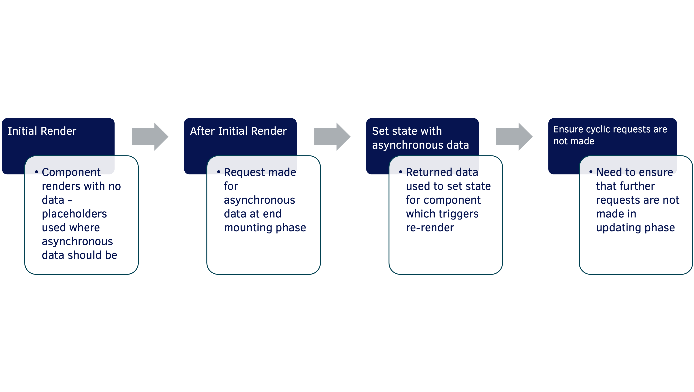

# Working with External Data - Part 3

## Outcomes

- To be able to use the `useEffect` hook
- To be able to get data from an external service in ReactJS
- To be able to send data to an external service in ReactJS

---

## React and RESTful APIs - Getting Data



- Can make use of Fetch API and Promises
- Make initial requests for data in __`useEffect`__ method
  - Called after component renders so placeholder can be used until data is returned from the source
  - Note the second argument of __`[]`__ in __`useEffect`__ call – this stops further __`fetch`__ calls being made

```jsx
useEffect(() => {
    fetch(`http://someRESTfulAPIURL.com`)
    .then(response => response.json())
    .then(people => setPeople(people));
}, []);
```

### Using `aysnc`/`await`

__`useEffect`__ cannot have an asynchronous callback\(at least in React v17.0.2). We can define an `aasync` function -inside* it and then call it:   

```jsx
useEffect(() => {
    const getData = async () => {
	    let response = await fetch(`http://someRESTfulAPIURL.com`);
	    let people = await response.json();
	    setPeople(people);
    };
    getData();
}, []);

```

>The __`async`__ function could be defined elsewhere in the code, although in this example, it is only ever used inside this __`useEffect`__ hook, so it makes sense to define it here.

---

## React and RESTful APIs - A Helper Package!

- Both of these methods require the conversion of the response into JSON
- __`Axios`__ is an __npm__ package that simplifies the use of __`fetch`__ and   __`async`__/__`await`__ by performing this step
  - Installed for the project using:
  - 
```sh
npm i axios
```

- Import __`axios`__ for use, then modify the call, extracting __`.data`__ from the __`response`__ without the need for a second `await` call

```jsx
useEffect(() => {
    const getData = async () => {
	    let response = await axios.get(`http://someRESTfulAPIURL.com`);
	    let people = response.data;
	    setPeople(people);
    };
    getData();
}, []);
```

---

## Effect skipping

To help explain how the __`useEffect`__ hook deals with stopping cyclic requests, understanding the class lifecycle method __`componentDidUpdate()`__ will help

- __`componentDidUpdate()`__ takes 2 optional arguments, __`prevProps`__ and __`prevState`__
  - Can compare either of these values to conditionally run code

__`useEffect`__ has an array of dependencies to match this behaviour

- If all dependency values are *unchanged*, the effect ***is not run***
- If any of the dependency values *change*, ***the effect runs***

```jsx
useEffect(() => {
 document.title = `Button clicked ${count} times`;
}, [count]);
```

An empty dependency array essentially tells React to only run this effect on initial render:

```jsx
useEffect(() => {
    const getData = async () => {
	    let response = await axios.get(`http://someRESTfulAPIURL.com`);
	    let people = response.data;
	    setPeople(people);
    };
    getData();
}, []);
```

## React and RESTful APIs - Sending Data

### Sending Data via POST/PUT requests

- To persist data in the application\, the external service needs to be able to receive new or updated data
- __HTTP POST__ requests ask for a new entry to be created
  - Sent to the URL used for _ALL similar items_
- __HTTP PUT__ requests ask for an existing entry to be modified
  - Sent to the URL to access the _individual item_
- Both requests require a `body` of the data to be created/updated

```js
const submit = async (data) => { await axios.post(URL_all, data); }

const update = async (data) => { await axios.put(URL_specific, data); }
```

---

## Activity 17a - Use an External Service - GET data

## Outcomes

-   To be able to fetch data from an external service

### Overview

In this activity, you will replace the static array with a call to an external REST API. To do this you will need to use the useEffect hook within **App** to make a GET call (using axios) to the retrieve the todos from your json-server and then set the todos in the app to this. Try/catch blocks should be used to conditionally render messages if the data is loading or if it fails to be fetched.

As the AllTodos component is dependent on the data, it should display a message to the user in place of the todo data should the data take longer to load than anticipated or the retrieval from the data source be unsuccessful.

You should use the **ExternalData/starter** folder or extend your previous Todo application.

### Action 1 - Use axios to obtain data from JSON server

1.  Ensure that JSON server is running a serving the **todoData.json** file:

```sh
json-server todoData.json -p 4000 --id _id
```

2.  On another command line, navigate to your project folder and run the following command to install **axios** and **dotenv** for** the project:

```
npm i axios dotenv
```

3. Create a file in the root of the project called `.env` and open it.
4. Set `REACT_APP_TODOSURL` to be `http://localhost:4000/todos` and save the file.
5. Open **App.js** for editing.
   
   
6. Add an **`import`** for `axios` from `axios`.

7.  Comment out the **`import`** for `sampleTodos`.

8.  Add a **new state** called `getError`, initially set to an ***object*** with a **key** of `message` set to and ***empty string*** and a **key** of `count` set to `0`.

9.  BEFORE **`useEffect`**, declare a `const` called `getTodos` and set
    this to be an `async` arrow function that:
    -   ***Tries*** to:
        -   Set a `const` called `res` to `await` the **return** of an `axios.get` call to `process.env.REACT_APP_TODOSURL`;

        -   **Returns** `res.data` if **`res.data`** has **`length`** otherwise **return** a `new Error` with its **message** set to `There are no todos stored` 
        -   **Catches** an error called `e` and:
            -   Calls `setGetError` with an object sets `message` to `Data not available from server: ${e.message}` and `count` to `0`.
        -   **Returns** an ***empty array***.

10.  In the **`useEffect`** function:

-   **Change** the call to `setTodos` so it `await`s a call to `getTodos`.

-   Surround the `setTodos` call in an ***async arrow function*** called `getData`.

-   Call `getData()`.
-   Add a ***dependency*** of an empty ***array***.

11.  Surround the **return** of the **App** component in a **React Fragment** and then *conditionally render* a **`Modal`** component (imported from **./Components/utils**) dependent on `getError.count` having a value of `0`.
    
12.  Pass the **`Modal`** component **props** of:

-   `handleClose` -- set to a callback that sets `getError` retaining its current `getError` object but sets `count` to `getError.count + 1`;

-   `message` -- set to the value of `getError.message`.

> This component will display a modal box if there is an error retrieving the data.

13.  Add a key of `error` to the `data` prop set in the `AllTodos` render and give this a value of `getErrormessage`.
14.  Save the file.

### Action 2 - Add error and loading handlers in the AllTodos Component

1.  Open **Components/AllTodos.jsx** for editing.

2.  Remove or comment out the existing logic in the component.

3.  Set a state of `dataStatus` with an initial **value** of an **object** that has **keys** of `name` and `message` and string **values** of `loading` And `Data is loading...`.

4.  Add a `useEffect` call that has:

    -   A ***destructuring*** of the `data` prop to `error`.
    -   An `if` statement that checks to see if `error` has a length and is this available returning setting the `dataStatus` state to `error` for `name` and `error` for `message`;

    -   If the `if` statement is not entered, reset the `dataStatus` state to its
        *initial values*;

    -   A **dependency array** that contains `data`.

5. Create a **function** called populateTable that:

    -   Destructures data to just todos (`const {todos} = data;`)
    -   An if statement to check if todos.length is greater than zero then:

        -   *Destructures* the currentTodo to its 4 properties;

        -   Declares a `const` called `displayTodos` which `map`s the `todos` array, passing in `currentTodo` and:
            -   Instantiates an *instance* of the `TodoModel` class using the `currentTodo`'s properties as `todo`;

            -   Returns a `Todo` component that passes in a **prop** of `todo` with a value of `todo` and a `key` of `todo._id`.
        - After the `map` function, returns `displayTodos`;  

    -   After the `if`, returns a *table row* with a *single cell* that:

        -   Uses the dataStatus.name property to set its id

        -   Spans 3 columns

        -   Has content of dataStatus.message.

    -   

6. In the return of the component, make the content of the *table body* call the function populateTable.

7. Amend the `PropTypes` for this component so data can now be `oneOfType` -- which is an **array** that contains the original **`exact`** object shape for a **`todo`**, or an **`object`** with a **key** of `error` and a **value** that is a **string**.

8. Save the file and run the application.

>It should still function as it did before we used the \'External Data\' source.

9. Locate the command line that is running JSON Server and stop it (using **CTRL+C**).
    
10. Refresh the application and you should see the **`Modal`** and then the ***error message*** in place of the **`todos`**.

11. Add a ***`setTimeout`*** that lasts ***5 seconds*** around the **`*getData()`*** call in ***`useEffect`*** in **App.js**
    
>You should see the *\"loading\"* message until the data is returned. You may remove this once you have checked -- this should be tested in any tests that you write.

12. Remove the ***todo objects*** from the **todoData.json** file and check that the correct message is displayed (you may need to restart **json-server** to effect this change).

## If You Have Time...

Read up on writing tests using **\@testing-library/react** to test whether the **AllTodos** component still renders correctly.

The code for this can be found in the **solution-activity17/src/tests/AllTodos.test.js** file and requires async tests that use screen, query helpers and matchers.

---

## Activity 18 - Use an External Service - POST/PUT data

### Outcomes

-   To be able to send data to an external service

### Overview

In this activity, you will add further functionality to the App component so that it is able to send the new todo submitted on the form to the REST API as POST request. To do this you will modify the submitTodo function in App.js so that rather than setting a new state, it sends the data to the REST service and then calls getTodos to retrieve them again. You should also manage the online status of the application during this process and any errors that may be returned.  

You should use the **Externaldata/starter** folder that you used for Activity 17, or use the **solution-activity17** folder as a base for this activity.

### Action 1 - Write a method to POST a new tod

1.  Ensure that JSON server is running a serving the **todoData.json**
    file:

```sh
json-server todoData.json -p 4000 \--id \_id
```

2. Open **App.js** for editing.
3. Add a **state** called `postError` with an *initial value* of an ***empty string***.

4.  Change `submitTodo` so that it is an **`async`** *arrow function* that takes `todo` as an argument and replace its body with:

    -   A **`try`** block that has:
        -   A call setting postError to an ***empty string;***
        -   An `await` for an `axios` `post` call providing `TODOSURL` and `todo` as arguments
    -   A **`catch`** block that takes `e` as an argument and sets `postError` to a **string** that explains the error;
    -   A **`finally`** block that calls `setTodos` with an call to `await` `getTodos()`

5.  After the condition render for the `getError` modal, add another *conditionally render* a `Modal` component dependent on `postError`. The `Modal` should receive **props** of:

    -   `handleClose` which is a **function** call to `setPostError` with an
        ***empty string***;

    -   `message`, which receives a value of `postError`.

6. Save the file.

> The application should function correctly. Check that you can persist a new todo and also that the error modal is displayed when you turn json-server off.

**If you have time...** 

Write functionality for the application that would allow the editing of a particular **todo**. See where you may be able to make components more type-safe using **PropTypes** or have cleaner code through *refactoring* and *destructuring*. Add any additional tests that you feel are required.

The solution for this can be found in the folder **solution-activity18-extended**. There is a *markdown* file in the project that explains the steps taken.

Note that some of the testing practices in this are older but they are still valid.

---

[&lt;-- Previous - 10. Working with External Data Part 2](./10-WorkingWithExternalDataPart2.md) | [Next - 12 - Single Page Applications Part 1 --&gt;](./112SinglePageApplicationsPart1.md)
