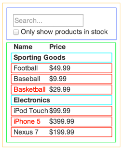

# Thinking in React – Parts 1 and 2

## Outcomes

- To understand the development methodology suggested for React applications
- To be able to identify the component hierarchy for a given application
- To be able to build a static version of an application
- Understand how to use Props in components
- To be able to test Component snapshots and Components with props
- To be able to Mock components when testing

---

## Thinking In React

- React makes developers think about the applications that are being built as they build them
- Facebook’s recommendation is to follow these steps when building apps using React:
  - Start with a mock
  - Break the UI into a component hierarchy
  - Build a static version in React
  - Identify the minimal \(but complete\) representation of UI state
  - Identify where your state should live
  - Add inverse data flow

### Start with a mock

All UIs to be built should have a mock up or a wireframe

Data should be available in a suitable format too

Facebook’s guide shows a Product Search page and some JSON for products:


```json
[
    {"category": "Sporting Goods", "price": "$49.99", "stocked": true, "name": "Football"},
    {"category": "Sporting Goods", "price": "$9.99", "stocked": true, "name": "Baseball"}, 
    {"category": "Sporting Goods", "price": "$29.99", "stocked": false, "name": "Basketball"},
    {"category": "Electronics", "price": "$99.99", "stocked": true, "name": "iPod Touch"}, 
    {"category": "Electronics", "price": "$399.99", "stocked": false, "name": "iPhone 5"}, 
    {"category": "Electronics", "price": "$199.99", "stocked": true, "name": "Nexus 7"}
]
```

## Thinking In React – Part 1 - The Component Hierarchy

**1\. Break the UI into a Component Hierarchy**

- Draw boxes around every component and subcomponent in the mock and give them names
  - Image layers may end up being names of components
- To help identify\, components should only do one thing
- Data model and data should map nicely
- **FilterableProductTable** - Yellow
- **SearchBar** - Dark Blue
- **ProductTable** - Green
- **ProductCategoryRow** - Light Blue
- **ProductRow** - Red
- Component Hierarchy already defined
- Not the only way to implement…



---

**You will now complete [Activity 6](https://github.com/digital-futures-academy/mse-software-development1/blob/main/workshops/ReactJS/4-ThinkingInReact1and2.md#activity-6---thinking-in-react-part-1---component-hierarchy) with your peer group**

---

## Thinking In React Part 2 - Static Versions

**2\. Build a static version in React**

- Build version that takes data model and renders UI without interactivity
  - Decoupling view and interactivity good as static versions are lots of typing and little thinking and vice versa for interactive versions
  - Best practice is to build components that reuse other components and pass data using _props_
    - _state_ not used as it is for interactivity
- Top\-down building as acceptable as bottom\-up
  - Bottom\-up more common in TDD environments
- Helps establish library of reusable components to render each data model
  - Each only has render method

---

## Testing Components – Snapshot Testing

- Useful for making sure that the UI does not change unexpectedly
- Process is to:
  - Render a UI component
  - Take a snapshot
  - Compare snapshot to reference snapshot file stored
- Test fails if 2 snapshots do not match
  - Because the change was unexpected
  - Because the snapshot needs to be updated to new version of the UI component
- `render()` (from `@testing-library/react`) is passed any component
  - Makes pure JS object as a representation of the React component
  - Use `toMatchSnapshot()` in an `expect` statement to compare
    - `toMatchSnapshot` compares the created component with the snapshot (and creates a snapshot if one doesn’t exist)

---

### Testing Components – Snapshot Testing Example

#### Component to test (in file **Button.jsx**)

```jsx
const Button = () => ( <button>Do nothing</button> ); 
export default Button;
```

#### Test Code (in file **Button.test.js**)

```js
import { render } from "@testing-library/react"; 
import Button from "./Button";

test(`Test matches snapshot`, () => { 
    const button = render(<Button />); 
    expect(button).toMatchSnapshot();
});
```
---

## React and Data

* React only supports UNIDIRECTIONAL data flow
  * Data flows from the top of a component tree to the bottom
  * Data cannot flow back up the component tree
* Data that does not change over the lifetime of the component should be considered as **props**
* Data that can change should be considered as **state**
  * State should be the single source of truth for changing data
  * All components that rely on this should receive the data as props
  * State should be in the highest common component of those that require the data

### What are props?

> “props are a way of passing data from parent to child”
> [http://facebook\.github\.io/react/docs/thinking\-in\-react\.html](http://facebook.github.io/react/docs/thinking-in-react.html)
 
  - i.e. a communication channel between components that always moves from the top (parent) to the bottom (child)

- **props** are immutable - once set, they cannot change
- **props** can be added as attributes in the component used when rendering them in the parent component
- And/or **default props** can be defined under the component declaration in the **.jsx** file:

```jsx
// When rendering in the parent component
<App headerProp = "Heading from attribute" />

// Under the class to provide defaults for
App.defaultProps = {
  headerProp : `Header from default`,
  contentProp : `This is default content`
}
```
---

## Using Props in Components

**props** must be passed to a Function component as an argument for it to be aware of them.

**props** rendered to the browser through the component return–either the default, or overriding value (if supplied)

```jsx
const App = props => (
  <> 
    <h1>{ props.headerProp }</h1>
    <p>{ props.contentProp }</p>
</> );
```

To make code *cleaner*, `props` can be deconstructed when passed in...:

```jsx
const App = ({ headerProp , contentProp }) => (
  <> 
    <h1>{ headerProp }</h1>
    <p>{ contentProp }</p>
  </> 
); 
```

... or in the `function` body before the `return`:

```jsx
const App = props => {
  const {headerProp, contentProp} = props;
  return (
    <> 
      <h1>{ headerProp }</h1>
      <p>{ contentProp }</p>
    </> 
  );
}
```

#### Default Props

These can be defined as an `object` under the Component's function:

```jsx

const App = props => {
  const {headerProp, contentProp} = props;
  return (
    <> 
      <h1>{ headerProp }</h1>
      <p>{ contentProp }</p>
    </> 
  );
}

App.defaultProps = { 
  headerProp : `This is the default heading`, 
  contentProp : `This is default content` 
}
```

If no value is supplied for the prop name used, it will either use the default (if supplied) or render nothing - consider this case here:

```jsx
ReactDOM.render (
  <App headerProp = "Header from attribute" />, 
  document.querySelector ('#app')
);
```

This could produce the output as shown here:


---

## PropTypes and validation

- Sub-object **propTypes** can be used for both typing and validation
  - Uses **PropTypes** class from **prop-types** npm package (from React 15.5)
  - Useful for ensuring correct usage of components
  - Makes code more readable–can see how component should be used

- **Typing**
  - Any valid JavaScript type can be used
  - Will produce console warning if correct type is not used for prop

- **Validation**
  - To ensure that a prop has a value supplied
  - **.isRequired** is chained to **propTypes** declaration
  - Will produce console warning if prop is not available

- Undeclared props are ignored by the browser
- When using **create-react-app** , the **prop-types** package is included by default
  - Only included in bundle if imported in app

### Prop-typing and Validation Example

```jsx
import React from "react"; 
import ReactDOM from "react- dom "; 
import PropTypes from "prop-types";

const App = ({ headerProp , contentProp , numberProp }) => { 
  return ( 
    <> 
      <h1>{ headerProp }</h1> 
      <p>{ contentProp }</p> 
      <p>Value of numberProp is: { numberProp }</p> 
    </> 
  ); 
};

App.defaultProps = { 
  headerProp : `This is the default heading`,
  contentProp : `This is default content` }

App.propTypes = {
  headerProp : PropTypes.string.isRequired,
  contentProp : PropTypes.string.isRequired,
  numberProp : PropTypes.number 
}

ReactDOM.render (<App numberProp ={10} />, document.querySelector ('#app'));
```

In this example, the `number` prop has to be a **number** if it is supplied, else there will be a **console** warning. Therefore, this component will be rendered as expected with the header and content being displayed from the default and `numberProp` being evaluated to `10` through the attributes.

---

## Testing Components with props

What should be Tested?

- A good rule of thumb is to test anything that:
- Does not duplicate the exact application code in the test
- Is not a responsibility or covered by other tests (i.e. libraries, core implementation, etc)
- Has detail that is important to outsiders
  - i.e. Can the effect of an internal detail be described using only the component’s public API?

### Testing props are rendered

There is no need to test if `defaultProps` are rendered
  - This is part of the implementation of React and will be tested already

There is no need to test if `PropTypes` work
  - This is the concern of the `prop-types` package and will be tested already

***We should test*** to see if the value of `props` received is rendered, especially if this can change at runtime

#### `@testing-library-react` tests for `props`

- `render` can be used to create a representation of a component

```jsx
import {render} from '@testing-library/react';

...
    render(<MyComponent content="Some value" />);
...
```

- `screen` can be used to query to output using some query methods
- DOM queries can be used to explore the `screen`
  - In the example we use the `getByText` query
    - Documentation on the [Types of Queries](https://testing-library.com/docs/queries/about/#types-of-queries) can be found in the documentation for `@testing-library/react`

```jsx
import {screen} from '@testing-library/react';

...
    const result = screen.getByText(`Some value`);
...
```

- Matchers can be used to test the actual values, such as `toBeInTheDocument()`

```jsx
...
    expect(result).toBeInTheDocument();
...
```


## ACTIVITY 6 - Thinking in React Part 1 - Component Hierarchy

## Objectives

-   To be able to take acceptance criteria, a mock-up and some static
    data to produce a suitable component hierarchy for an application

## Overview

In this activity, you will use acceptance criteria, the provided mock-ups and static data to identify a component hierarchy for a Todo application. A hierarchy is needed for an 'AllTodos' UI and an 'Add/Edit Todo' UI.

## Activity

1.  Using the information provided below, create a component hierarchy
    for the 'AllTodos' UI and the 'Add/Edit Todo' UI.

### Acceptance Criteria -- Common UI Components

| Footer                                          | Header                                          |
| ----------------------------------------------- | ----------------------------------------------- |
|  |  |


### Acceptance Criteria - Specific UI Components

| All Todos View                                            | Add/Edit Todo View                                   |
| --------------------------------------------------------- | ---------------------------------------------------- |
|  |  |

### Mock Data

A copy of this data is also available in the file **sampleTodos.json**
in **StaticVersion/starter/src**.

#### Notes:

-   `_id` is in the format generated when an item is added to B
-   `todoDateCreated` is in *ISO Date format* as this is used to store dates/times in MongoDB.

```json
[
  {
    "_id": "5cc084952deb33810d2ec464",
    "todoDescription": "Sample Todo 1",
    "todoDateCreated": "2019-05-04T15:00:00.000Z",
    "todoCompleted": true
  },
  {
    "_id": "5cc08495bf3fd62d03f2f4c2",
    "todoDescription": "Sample Todo 2",
    "todoDateCreated": "2019-05-04T15:30:00.000Z",
    "todoCompleted": true
  },
  {
    "_id": "5cc08495bf3fd62d03f2f4c2",
    "todoDescription": "Sample Todo 3",
    "todoDateCreated": "2019-05-04T15:45:00.000Z",
    "todoCompleted": false
  },
  {
    "_id": "5cc08495bf3fd62d03f2f4c2",
    "todoDescription": "Sample Todo 4",
    "todoDateCreated": "2019-05-04T16:00:00.000Z",
    "todoCompleted": false  
  }   
]
```

### Wireframes/Mock Ups

#### All Todos


#### Add/Edit Todo


---

## ACTIVITY 7a -- Create Common Header and Footer Components

### Objectives

- To be able to create static Function components and integrate them
    into an application

### Overview

In this activity, you will create the components for the header and footer sections of the application. These components will be placed in the Components folder of the application and linked to the App component to display them. The acceptance criteria should be used as a guide to create the components in the first instance. A step-by-step guide is provided after the Desired Outcome.

### Actions -- Header and Footer Acceptance Criteria

You will find that this project has already been set up and imports Bootstrap to enable a fully responsive application to be made. The logo can be found in the Components/images folder as an SVG and should be imported into the header. Additional CSS has been provided (along with branding fonts) and is imported into the **index.js** file so it is available anywhere in the Component tree.

Make sure that you have run `npm i` for the project before beginning.

1.  Use the acceptance criteria from Activity 6 to create Header and Footer components.
2.  Import these into the App component to display them.

### Desired Outcome


#### Header Stepped Instructions

1. In **StaticVersion/starter/src/Components** create a new file called **Header.jsx**.
2. Add an import of logo from \'./images/logo.svg\'.
3.  Create a **Function component** called Header that has *no parameters*.
4.  The return of the component should have wrapping `<header>` and
    `<nav>` elements:
    - `<nav>` should have classes `navbar navbar-expand-sm`;
    - A **link** to <https://www.digitalfutures.com> with a **`class`** of `navbar-brand`, a **`target`** of `_blank` and a **`rel`** of `noopener noreferrer`;
    - The **link** should contain an **image** whose **`src`** is **`{logo}`**, and **`alt`** is DigitalFutures and **`width`** is `100`;
    -   A **sibling link** to `/` with a **`class`** of `navbar-brand` and
        **text** of `Todo App`.
5. `export` `Header` as `default`.
6. Save the file.
7. Open **App.js** from **/src** for editing.
8. Add an `import` for `Header` from `./Components/Header`.
9. Within the outer `<div>`, add a **child** of `<Header />` as an **older sibling** of the inner `<div>`.
10. Save the file.

#### Footer Stepped Instructions

1. In **src/Components** create a new file called **Footer.jsx**.
2. Create a **Function component** called **Footer** that has *no parameters*.
3. The return of the component should have wrapping `<footer>` element that:
    -   Has Bootstrap classes of `mt-auto` (to set the top margins to
        automatic), `py-3` (to set padding left and right to 1rem),
        `text-center` and `container`;
    -   Has text content of `© Digital Futures 2021-.
4.  `export` `Footer` as `default`.
5.  Save the file.
6.  Open **App.js** from **src** for editing.
7.  Add an `import` for `Footer` from `./Components/Footer`.
8.  Within the outer `<div>`, add a **child** of `<Footer />` as a
    **younger sibling** to the inner `<div>`.
    Save the file.

    Use `npm start` to run the application and check that the output is as
    shown in the desired outcome as above.

    ---

## ACTIVITY 7b -- Write Snapshot Tests

### Objectives

-  To understand how to write a simple Snapshot tests

### Overview

In this activity, you will add 2 tests to the `tests` folder, one for the `Header` component and one for the `Footer` component. These should be simple snapshot tests as the components will not change much one development is complete.  You will use the create function to create a version of the component and then expect it **toMatchSnapshot**. The **`npm test -- --coverage**` command will be used to run the tests and create coverage reports.

Remember that the test may initially fail as there is no snapshot and that if you change the code in the component, you will need to update the snapshot to make the test pass again.

### Actions - Test the Header

1. In the **tests** folder, create a new file called **Header.test.js**.
2. `import` `render` and `screen` from `@testing-library/react`.
3. Import the `Header` component from the **Header** file in the **Components** folder.
4. Write a test with the **title** Header matches snapshot and a **callback function** that:
    - Declares a `const` `header` set to the result of a call to `render`, passing `<Header />` as an argument
    - `expect` a call to `header` that uses the matcher `toMatchSnapshot()`.
5. Save the file.
6. Check that the test runs and passes.

### Actions -- Test the Footer

1.  Repeat the process above, substituting the Header for Footer.

### Ensure the tests fail

1.  Change some of the displayed text inside appropriate tags in both of the component files and save them.
2.  Observe that the tests now fail -- DO NOT UPDATE the snapshots.
3.  Change the text back to the original and ensure that the tests pass again.

---

## ACTIVITY 8 - Exploring Props 

### Objectives

- To be able to use props in a component
- To be able to define propTypes for a component's props and ensure that they are present if needed
- To be able to supply defaultProps for a component
- To be able to pass props to a child from its parent

## Overview

In this activity, you will create a component called **ComponentWithProps** that uses 4 props (**header**, **content**, **number** and **nonexistent**) to populate a header and 3 paragraphs in its **return**. This will be rendered by the **MyComponent** component.

You will observe the output and then add **PropTypes** for **header**, **content** (both strings) and **number** that are all required. The browser output will be observed again. Next, **defaultProps** will be added for header, content and number before providing actual props for **content** and **number** when it is called in the render of **MyComponent**. Finally, you will inspect the browser output to ensure all warnings have been removed.

## Actions - ComponentWithProps - Step-by-Step

**Work in the IntroToReact/starter project.**

1. Create a new file called **ComponentWithProps.jsx** in **starter/src**.
2. Define a **Function component** called `ComponentWithProps` that has `props` as an argument and a return that has:
    - A wrapping **React Fragment**;
    - A `<h1>` that uses `header` from `props` as its content;
    - A `<p>` that uses `content` from `props` as its content;
    - A `<p>` that uses `number` from `props` as its content along with *some text*, also add an attribute of `data-testid` set to `"numberPara"` (for use in testing later);
    - A `<p>` that uses `nonexistent` from `props` as its content along with *some text*.
3. `export` `ComponentWithProps` as `default`.
4. Save the file.
5. Open **MyComponent.jsx** for editing and import the *new component*.
6. *Add it* to the return but ***DO NOT*** supply any props at this point.
7. Ensure that you wrap the return of **MyComponent** in a **React Fragment**.
8. Save the file and run the application.

>You should find that the application runs without errors (check the console), although there are empty elements where props were not found and spaces where props where included as part of other text.

### Actions - Using PropTypes - Step-by-Step

1. In **ComponentWithProps.jsx**, add an `import` for `PropTypes` from `prop-types`.
2. Before the `export` statement, add `ComponentWithProps.propTypes` and set it to an **object**.
    - Add **keys** of `header` and `content` with **values** that will **ensure** that **both** are **required** **strings**;
    - Add a key of `number` with a **value** that will ensure it is a **required** **number**.
3. Save the file and return to the browser console output.

> You should see that the application still renders the same but there are 3 warnings displayed on the console.


### Actions - Using defaultProps - Step-by-Step

1. Under the **PropTypes** defined in the last part, add a declaration for `ComponentWithProps.defaultProps` and set it to an object.
    -   Add a **key** of `header` with string **value** `Header from defaults`;
    -   Add a **key** of content with string **value** `Content from defaults`;
    -   Add a **key** of number with a **value** of `100`.
2.  Save the file and check the browser console output.

> You should see that the warnings have disappeared, with values supplied as defaults displayed on the web page.


## Actions - Supplying props from the Parent -- Step-by-Step

1. Open **MyComponent.jsx** for editing and add another **ComponentWithProps** to the return, supplying the following **`props`** (attributes):
    - `content` with a string **value** of `Content passed from props`;
    - `number` evaluated in JavaScript to `10`.
2. Save the file and view the browser.

>You should notice that the values displayed on the web page in the second rendering of **ComponentWithProps** match those to where they are picked up from in the code.


---

## ACTIVITY 9 - Testing Props

### Objectives

- To be able to use react-test-renderer to be able to test that supplied props are rendered in components

## Overview

In this QuickLab, you will write 3 tests for the **ComponentWithProps** component. The tests will ensure that if one of the props that is rendered as part of the component is supplied, it is in fact rendered. The tests will use the create function supplied by react-test-renderer and generate a test instance of the component. Following this, the component will be interrogated using the **testInstance** functions **findByType** and **findAllByType**. Checking the children property of the 'rendered' instance will allow the value that will be displayed to be checked. These are tested as they affect the view that the user will see.

It is assumed that **PropTypes** and **defaultProps** that are supplied to the component are not the concern of the developer as these are part of React and are therefore assumed to be tested! 

### Actions 9.1 - Test the header prop

1. Create a folder in **src** called **tests** and create a file called **ComponentWithProps.test.js**.
2. Add an `import` for `{ render, screen }` from `@testing-library/react`.
3. Import `ComponentWithProps` from its file.
4. Define a test with the **title** of `it should render the correct heading from props when a header prop is supplied` and initialise an arrow function as a callback.
5. Populate the arrow function with code that:
    -   Defines a `const` called `testHeaderValue` set to a **string** with *some
        text*;
    -   Calls `render` with a `ComponentWithProps` component that has a **`prop`** of `header` set to `testHeaderValue`;
    -   **Asserts** that the query`getByText` on `screen` using `testHeaderValue` will *be in the document*.
6. Save the file and run the command `npm test` on the command line.

>This test should pass -- change the assertion to make it fail and then make it pass again.

## Actions 9.2 - Test the content prop

1. Define a test with the **title** of `it should render the correct content from props when a content prop is supplied` and initialise an arrow function.
2. Populate the arrow function with code that:
    -  Defines a `const` called `testContentValue` set to a **string** with *some text*;
    -  Calls `render` with a `ComponentWithProps` component that has a **`prop`** of `content` set to `testContentValue`;
    -  **Asserts** that the query`getByText` on `screen` using `testHeaderContent` will *be in the document*.
3.  Save the file and observe the test results.

>This test should pass -- change the assertion to make it fail and then make it pass again.

### Actions 9.3 - Test the number prop

1. Define a test with the **title** of `it should render the correct number from props when a number prop is supplied` and initialise an arrow function.
2. Populate the arrow function with code that:
    -  Defines a `const` called `testNumber` set to any number;
    -  Calls `render` with a `ComponentWithProps` component that has a **`prop`** of `number` set to `testNumber`;
    -  **Asserts** that the query`getByTestId` on `screen` using `numberPara` and accessing it's `textContent` will *contain* the `testNumber` as a `string`.
3.  Save the file and observe the tests.

>This test should pass -- change the assertion to make it fail and then make it pass again.

---

[&lt;-- Previous - 3. Testing](3-Testing.md) | [Next - 5. Thinking in React Part 2 Part 2!--&gt;](5-ThinkingInReactPart2Part2.md)
