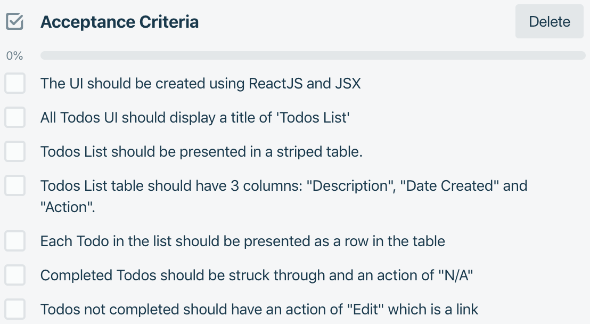

# Thinking In React Part 2 (Part 2) Using Static Data in Applications

## Outcomes

- To be able to build a static version of an application
- Understand how to use Props in components

---

## Data Sources

- React is for producing front end components
- Need to be able to convert data from data sources into state and/or props
  - E\.g\. Displaying a list of items in a table from a HTTP search response
- Can convert data source into an array or create one from it
  - Array can then be stored in state
  - Component can then use JavaScript map function to return state array as modified array of Components which are then displayed on the screen

## Importing static data

- If a JSON file can be made available\, this can be imported with a name into the application
- An alias is given so that the array can be used
- Often in React an array of data is mapped to return a Component
  - Each element in the array is passed to the Component as a prop and used to generate a unique component
  - The mapped array is used to display the contents of the array

```jsx
import Data from "./Data";
import someData from "./someData.json ";

const AllData = () => { 
    
    const allData = someData.map (data => <Data item={data} key={ data.id } />);

    return ( 
        <> 
            <h2>The data supplied is:</h2> 
            <div> { allData } </div> 
        </> 
    ); 
}; 

export default AllData ;
```

### Using a dataset - `map()` example

Imagine we have an array called **`people`** that stores a person object holding an ID, their first name and their country of origin, imported from an external source such as a JSON file

- Array can then be used in the render function to produce JSX code for each person in the array through the **`map()`** function
- **`map()`** works in the following way:
  - For every item in the array, take *item* itself and its `index`
  - Creates a new anonymous function that receives *item* and `index` and returns a value of the *modified data*

```jsx
{ people.map(person => (
    <p>This is { person.name }, they’re from{ person.country }</p>
  ))
};
```

### Array/Iterators and Keys

- Running the code above in this way and render it in a component would produce a warning on the console


- React likes each every top-level item printed by a loop to have a **KEY** attribute that identifies it uniquely
  - Called **RECONCILIATION**
  - Helps React identify which items have been modified
  - Best practice to select a string that uniquely identifies a list item amongst its siblings (*no need to be globally unique*)
    - Most often ID from the dataset
    - Can be `index` of array as ***a last resort***
  - Keys should be kept on the element containing each array item that is produced rather than the root element

Dealing with the warning is important for more advanced apps.

The key attribute should be added to the wrapping element of the return of the anonymous function:

```jsx
{ people.map (person => (
        <p key={ person.id.toString ()}> 
            This is { person.name }, they’re from{ person.country } 
        </p>
    )
)};
```
#### Using Sub-Components to render array items

- Data can be passed from state of a parent component to a child using props using a sub-component 
    - Create a `Person` Function Component and pass `person` as a prop

```jsx
import Person from './Person';
import people from './peopleData.json';

const PeoplePrinter = () => {
    return (
        <>
            { people.map(person => (
                <Person 
                    key={ person.id } 
                    name={ person.name }
                    country= { person.country } 
                />
            ))}
        </>;
    );
}

export default PeoplePrinter;
```

```jsx
// And the Person sub-component
const Person = ({name, country}) => (
    <p>This is { name }, they're from { props.country }</p>
);

export default Person;
```

---

## Conditional Rendering

- Often desirable to only render certain items dependent on certain conditions
- Conditional rendering in React works in the same way as conditional statements in JavaScript
  - If statements can be used to create a return for a Function component
  - Ternary statements can be used within the return of a Function component
  - They can also be used to conditionally set properties\, such as `className`

Render a button for log in or log out depending on a logged in status:

```jsx
const Login = props => { 
    if( props.isLoggedIn ) { 
        return <button onClick ={ props.logout }>Log Out</button>
    } else { 
        return <button onClick ={ props.login }>Log In</button>
    }
};

export default Login;
```

### Conditional Rendering – Element Variables

The previous example could have been re-written as below, using a ternary statement (with an additional example):

#### Conditional Rendering – Inline If-Else with Conditional Operator

```jsx
const Login = props => (
    <> 
        { props.isLoggedIn ? 
            (<button onClick ={ props.logout }> Log Out </button> ) 
          : 
            ( <button onClick ={ props.login }> Log In </button> )
        }
    </>
);

export default Login;
```

#### Conditional Rendering - Inline If with Logical && Operator

JSX expressions can be embedded by using curly braces, including the use of the `&&` logical operator:

```jsx
const UnreadMessages = props => ( 
    <> 
        <h2>Welcome back, { props.name }!</h2> 
        { props.unreadMessages.length > 0 && <p> You have { props.unreadMessages.length } unread messages. </p> }
    </> 
); 

export default UnreadMessages ;
```

---

## Mocking Components for Tests

### Using `jest.mock` to return a Component

> Why Mock components?

- To unit test a component that renders other components
  - Not interested in the sub-component’s implementation

### How to mock a component

Call `jest.mock(`./path/to/component/to/mock`, [, options])`;

Supply a callback in options that returns a **function** to mock the component

```js
jest.mock (`./components/MyComponentToMock `, () => { 
    return function MyMockedComponent () {
        return <span>Mocked Component</span>
    }
});
```

Wherever `MyComponentToMock` is used in the Component being tested, it will simply render a `<span>` with the text `Mocked Component` in it.

As this is the case, we can see if the component actually renders the mocked component without having to worry about any of its functionality - such as required `props`, etc

---

# ACTIVITY 10a -- Thinking in React Part 2 -- A Static Version -- Components with static data

## Outcomes

- To be able to use static external data to populate components
- To be able to use the map function to create multiple components
-  To be able to conditionally render items dependent on some value

## Overview

In this activity, you will use the data supplied in the file **src/sampleTodos.json** to populate the AllTodos view. You should use the component hierarchy identified earlier (and shown below) and the Acceptance Criteria to produce the components needed for the AllTodos UI. A Todo model (basically a JavaScript class to define the shape of a Todo) has been defined in the **./utils** folder for use with the **`instanceof`** **`PropTypes`** check.

Continue working in the **StaticVersion/starter** folder.

### Component Hierarchy


| Component    | Colour                                               |
| ------------ | ---------------------------------------------------- |
| **App**      | <span style="color: rgb(255, 255, 0)">Yellow</span>  |
| **Header**   | <span style="color: rgb(0, 176, 80)">Green</span>    |
| **AllTodos** | <span style="color: rgb(112, 48, 160)">Purple</span> |
| **Todo**     | <span style="color: rgb(255, 0, 0)">Red</span>       |
| **Footer**   | <span style="color: rgb(237, 125, 49)">Orange</span> |

### Acceptance Criteria



---

## Desired Outcome


## Action 1 -- The Todo component

1. Create a new file in the **src/Components** folder called **Todo.jsx**.
2. Insert the *boilerplate code* for an *empty Function component* that receives a **prop** of `{todo}`.
3. *Import* `PropTypes` from `prop-types`.
4. *Import* `TodoModel` from `./utils/Todo.model`.
5. Set a `const` `dateCreated` to be a `new Date` that **parses** the `todo.todoDateCreated` and converts it to a **UTC string**.
6. Set a `const` `completedClassName` that is *conditionally set* to `completed` if `todo.todoCompleted` is **true** and an *empty string* if not.
7. Declare a variable `completed`.
8. Use an `if` statement to set `completed` to the **string** `N/A` *if* `todo.todoCompleted` is **true** and to the *markup* `<a href="/">Edit</a>` if not.
9. **Return** a **table row** that has *3 cells* whose *first 2* have a `className` set by `completedClassName` and whose **content** is `todo.todoDescription` and `dateCreated` respectively. The *final cell* should **render** the `completed` variable.
10. **Before** the `export` statement add `Todo.propTypes` as an **object** that sets a **key** of `todo` to be a **call** to `instanceOf` on `PropTypes`, passing `TodoModel` as the argument.
11. Save the file.

## Action 2 -- The AllTodos component

1. Create a new file in the **src/Components** folder called **AllTodos.jsx**.
2. Insert the boilerplate code for an empty Function component that receives *no props*.
3. Import the provided CSS file for **AllTodos** found in the **css** folder.
4. Import sampleTodos from the **sampleTodos.json** file.
5. Import `Todo` from the **Todo** file.
6. `TodoModel` should be imported from **./utils/Todo.model**.
7. Inside the component function, set a `const` `todos` that **maps** the `sampleTodos` array with an arrow function that:
    -   Takes `currentTodo` as an argument;
    -   Has a line in the function body that creates a **`new`** `TodoModel` called `todo` by passing in the properties from `currentTodo` in the order **`description`**, **`dateCreated`**, **`completed`** and
        **`_id`** into the **`TodoModel`** *`constructor`*;
    -   **Returns** a `Todo` component with a **property** of `todo` set to
        the `todo` and a `key` of the ***todo's `_id`***.
8. Make the component **return** a wrapping `div` with a `className` of `row` with:
    -   A `h3` with **text** of `Todo List`;
    -   A *sibling table* with *classNames* `table` and `table-striped`;
    -   A `thead` that has a *table row* that has the 3 headings **Description**, **Date Created** and **Action**;
    -   A `tbody` that renders the *array* of `todos`.

**Hint:**
<details>
An array of JSX Components can be simply put inside a set of curly braces

```jsx
    ...
    <tbody>
        {todos}
    </tbody>
```

</details>


9. Save the file.

## Action 3 -- Render the AllTodos component

1. Open **App.js**.
2. Replace the placeholder text inside the inner `div` with the *`className`* `container` with an `AllTodos` component.
3. Save the file and fire up the application.

> Your output should look like the desired outcome.

---

## Activity 10b -- Thinking in React Part 2 -- A Static Version -- Testing Components with static data 

### Outcomes

-   To be able to test that a component renders the correct number of children
-   To be able to test that a component renders conditional items correctly dependent on a prop

### Overview

In this activity, you will write tests for the Components you have just made. The **AllTodos** component should be tested to ensure that the number of **Todo** components rendered is the same as the length of the static array that has been used to generate it. The **Todo** component is a little more convoluted, as there are 2 conditional statements that affect the output, both based on the **todoCompleted** status. You should test to see if the correct **className** is added to the **Description** and **Date Created** cells and also that the correct text is displayed in the **Action** cell.

Continue working in the **StaticVersion/starter** folder.

### Action 1 -- Write Tests for the AllTodos Component

1. In the **src/tests** folder, create a new file called **AllTodos.test.js**.
2. Import `{ render, screen }` from `@testing-library/react`, `AllTodos` from **../Components/AllTodos** and `sampleTodos` from **../sampleTodos.json**.
3. Write a test with the title `it should render the correct number of Todo components based on the todo array supplied` and add the arrow function.
4. Populate the arrow function with:
    -   A `const` called `sampleTodosLength` set to the `length` of `sampleTodos`;
    -   Call `render` passing in an `AllTodos` component that has a prop of `todos` set to `sampleTodos`
    -   Defines a `const` called `numberOfRows` that is set to the `length` of a `getAllByText` query on `screen`, looking for the RegEx `/sample/i`
    -   **Asserts** that the `numberOfRows` *to Be* `sampleTodosLength`.
5. Save the file and run the tests.

> All tests should pass, including the new test on **AllTodos**. For peace of mind, change the value of **sampleTodosLength** to any value other than 4 (as this is the actual value) and check that it fails.

### Action 2 -- Write Tests for the Todo Component - className

1. In the **src/tests** folder, create a new file called **Todo.test.js**.
2. Import `{ render, screen }` from `@testing-library/react`, `Todo` from **../Components/AllTodos** and `TodoModel` from **../Components/utils/Todo.model**.
3. Create a ***mock*** of the `TodoModel` to return a class called `TodoModel` that has a constructor that sets:
    -   `todoDescription` to `Test Todo`;
    -   `todoDateCreated` to `2019-05-04T15:30:00.000Z`;
    -   `todoCompleted` to `true`.

Use the `jest.mock` function with a **string** argument of the ***relative path to the component*** and an **arrow function** that **returns** the above.

**Note:** This is not best practice but a situation where we can practice mocking! In reality, we would just use the class to instantiate a test object.

#### Write the test suites

1. Create a wrapping test suite (`describe` call) that has the title of `Todo test suite` and an arrow function.
2. In this suite, make variable declarations for testTodo, todoDescription and todoDateCreated.
3. Add a beforeEach that:
   - initialises testTodo to be a new instance of TodoModel
   - Deconstructs the testTodo to todoDescription and todoDateCreated

**Hint:**

<details>

```jsx
    ({ todoDescription, todoDateCreated} = testTodo);
    // Note the brackets surrounding the deconstruction statement!
```

</details>
<br>

4. Nest another test suite with the title `Testing render when todoComplete is true` and an arrow function.
5. Inside this suite, write a `beforeEach()` which calls `render` passing in the following mark-up:

```jsx
    render(
        <table>
            <tbody>
                <Todo todo={testTodo} />
            </tbody>
        </table>
    );
```

6. Write a test with the title `it should render 2 tds with className completed` and add the arrow function.
7. Populate the arrow function with:
    - A `const` called `date` set to be a *new instance* of `Date` parsed to a UTC String (use `.toUTCString()`);
    

>The `<Todo />` component has to be wrapped in a `<table>` and `<tbody>` elements to preserve the rules of HTML - `Todo` renders `<tr>`s and `<td>`s and these should only be inside these wrappers 

-
   - Defines a `const` called `descriptionCell` that is set to a `getByText` query on `screen` looking for `todoDescription`;
   - Defines a `const` called createdCell set to the result of `getByText` query on `screen` looking for `date`;
   - **Asserts** that the `className` property of `descriptionCell` is `completed`;
   -  **Asserts** that the `className` property of `createdCell` is `completed`;

7. Save the file and verify that the test passes.

### Action 3 -- Write Tests for the Todo Component -- Action render

1. Write another test with the title `it should render 'N/A' in the last td of the row` and add the arrow function.
2. Populate the arrow function with:
    -  A `const` called `expectedAction` set to be the string`N/A`;
    -  **Assert** that the `getByText` query on `screen` looking for `expectedAction` is in the document.
3. Save the file and verify that the test passes.

### Action 4 -- Tests for when `todoCompleted` is `false`

Using the previous suite as a template, write a second test suite with the title `Testing render when todoCompleted is false`

The trick is to remember that in the `beforeEach` for this suite, you should set `testTodo.todoCompleted` to `false` ***BEFORE*** rendering the component.

You should expect the className `toBeFalsy()`.
You should expect the action `Edit` `toBeInTheDocument()`.

---

## Activity 10c -- Thinking in React Part 2 -- A Static Version -- Adding a Form

### Outcomes

- To be able to add a static, non-interactive form to an application

### Overview

In this activity, you will create the components needed to put the UI to add or edit a Todo into the application. Use the acceptance criteria and the mock-up provided to help. A **TodoForm** component will be created that allows the input of the todo's description, uses a supplied utility component called **DateCreated** (available in **/Components/utils**), provides a checkbox for the 'completed' status and a submit button. A wrapping **AddEditTodo** component will be created to provide the title and render the form and this will be added under the **AllTodos** component in the **App** component.

Continue working in the **StaticVersion/starter** folder.


### Desired Outcome


### Action 1 -- Create the TodoForm Component

1. In the **Components** folder, create a new file called **TodoForm.jsx**.
2. Add the boilerplate code to create a Functional component that does not receive any props.
3. Import `DateCreated` from **'./utils/DateCreated**.
4.  Make the function **return** a wrapping **form** element that
    encloses:
    - A **div** with a **className** of `form-group` containing:
        - A **label** **for** `todoDescription` with the **content** of `Description:&nbsp;`
        - A **text** **input** with a **name** of `todoDescription`
        - A **placeholder** of `Todo Description` and a **className** of `form-control`.
    - A **div** with a **className** of `form-group` containing:
        - A **label** **for** `todoDateCreated` with the **content** of `Created on:&nbsp;`
        - A **DateCreated** component.
    - A **div** with a **className** of `form-group` containing:
        - A **label** **for** `todoCompleted` with the **content** of `Completed:&nbsp;`
        - A **checkbox** **input** with a **name** of `todoCompleted`.
    -   A **div** with a **className** of `form-group` containing:
        -   A **submit** **input** with a **value** of `Submit` and
            **classNames** `btn` and `btn-primary`.
5.  Save the file.

### Action 2 -- Create the AddEditTodo Component

1. In the **Components** folder, create a new file called **AddEditTodo.jsx**.
2. Add the boilerplate code to create a Functional component that does not receive any props.
3. **Import** **AddEditTodo.css** from the appropriate path
    (**./css/AddEditTodo.css**).
4. The **return** of the function should be a wrapping
    **React.Fragment** that encloses:
    - A **div** with **classNames** of `addEditTodo` and `row` that wraps a **h3** element with the **content** `Add/Edit Todo`;
    - A **`TodoForm`** component (imported from **./TodoForm**).
5. Save the File.

### Action 3 -- Add the new components to the app

1.  Open **App.js** for editing.
2.  **Import** and then **add** the **AddEditTodo** component under the **AllTodos** component.
3.  Save the file.

> Launching the application in the browser should show the UI as shown in the desired outcome. Additionally, check that the 4 rendered Todo components prop values show in the Component section of the React Developer Tools:


---

## Activity 10d -- Thinking in React Part 2 -- A Static Version -- Test the Form rendering

### Outcomes

- To be able to make mock components to ensure correct rendering

### Overview

In this activity, you will create a test file for the **TodoForm** component. It has a sub-component of **DateCreated**, so you will define a mock for this component and then check to see if the mock is rendered. The mock should return a **function** that renders a **span** with a **testid** property set to **dateCreated**. The content of the **span** should be **Date Created Component**. The test should **assert** that
the **span** with a **prop** of **testid** contains this **text**. 

Continue working in the **b-static-version/starter** folder.

## Action 1 - Create the test

1. Add a new file called **TodoForm.test.js** to the **tests** folder.
2. Import `{ render, screen }` from `@testing-library/react` along with the `TodoForm` component.
3. Provide a `jest.mock` implementation for the `DateCreated` component that can be found in the folder **/src/Components/utils/**.
   - The callback for the mock should return a function called `MockDateCreated`.
   - This function should `return` a `<span>` with an **attribute** of `testid`
    set to `dateCreated` and **content** of `Date Created Component`.
4. Create a test suite with the title `TodoForm test suite`.
5. Add a before each that calls `render` with a `TodoForm` component.
6. Create separate tests that:
    - Checks that the Description input and label are rendered by using the query `getByPlaceholderText` on `screen` looking for `Todo Description` to be in the document
    - Checks that the Completed input and label are rendered by using the query `getByLabelText` on `screen` looking for `Completed: ` to be in the document
    - Checks that a DateCreated component is rendered by using the query `getByTestId` on `screen` looking for `dateCreated` has textContent that contains `Date Created Component`
    - Checks that a submit button is rendered by using a `getByText` query on `screen` looking for the string`Submit` to be in the document.
7.  Save the file and run the tests.

> There should be no test failures.

**If you have time:**
-   Write tests for the **AddEditTodo** component, checking that the
    correct **classNames** are rendered in the div and that it does
    actually render a **form**;

---

[&lt;-- Previous - 4. Thinking In React Parts 1 and 2](./4-ThinkingInReact1and2.md) | [Next - 6. Thinking In React Part 3 --&gt;](./6-ThinkingInReactPart3.md)