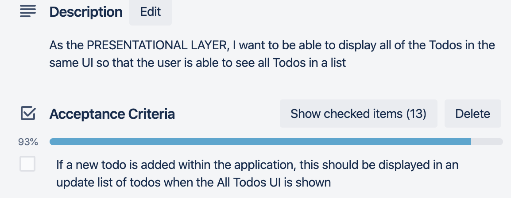
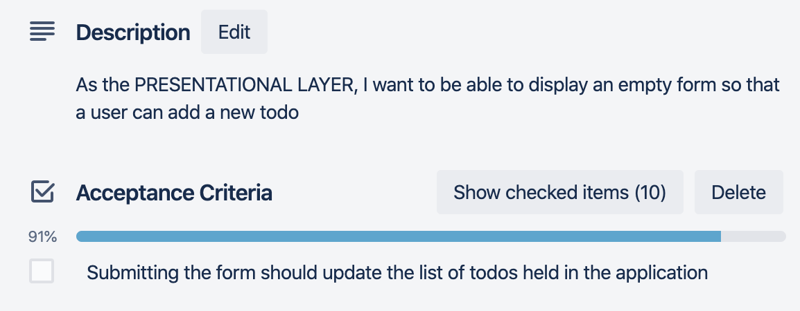

# Thinking In React – Part 3 - Identifying State

## Outcomes

- To be able to identify State in an application

---

## React and Data

**Reminder:**

- React only supports UNIDIRECTIONAL data flow
  - Data flows from the top of a component tree to the bottom
  - Data cannot flow back up the component tree
- Data that does not change over the lifetime of the component should be considered as **props**
- Data that can change should be considered as **state**
  - State should be the single source of truth for changing data
  - All components that rely on this should receive the data as props
  - State should be in the highest common component of those that require the data

## Thinking in React Process

0. Start with a mock
1. Break the UI into a component hierarchy
2. Build a static version in React
3. **Identify the minimal \(but complete\) representation of UI state**
4. Identify where your state should live
5. Add inverse data flow

## 3\. Identify minimal \(complete\) representation of UI state

>_props is data passed in as an HTML attribute when the component is created_

- Require ability to trigger changes
  - Made easy through use of *state*
- Best practice to first think of minimal set of mutable state app needs
  - Everything else computed on demand
  - In example\, these are:
    - Original list of products
    - Search text user enters
    - Value of checkbox
    - Filtered list of products

**To figure out state\, ask:**

- Is it passed in from a parent via props? Probably isn’t state
- Does it remain unchanged over time? Probably isn’t state
- Can you compute it based on any other state or props in the component? Isn’t state

**In the Filterable Product Table example:**

- _Original list of products_ –passed in as props and does not changes over time– __not state__
- _Search text user enters_ – __state__
- _Value of checkbox_ – __state__
- _Filtered list of products_ –can be computed by combining original list of object\, search text and checkbox value – __not state__

---

## Peer Group Activity - Activity 11 - Thinking in React Part 3 - Identifying State in the Todo App

### Outcomes

- To be able to make decisions about what should and should not be state in an application.

### Actions

Consider the following data that is needed in the application and decide
whether it should be state or not:

- The List of Todos;
- The Description property of a NEW todo;
- The Date Created property of a NEW todo;
- The Completed property of a NEW todo.

The **Acceptance Criteria** should be considered:

---

#### Example Solution

Note that this is not necessarily the \'right\' answer, it is one of
several possibilities:

**List of Todos**
*Does it remain unchanged over time?*

According to the new Acceptance Criteria, this list may change as a result of the user adding new todos when they are using the application. On this basis, this data needs to be held in state at this point in the application development.  

It is not passed in from a parent via props and it cannot be computed based on any other state or props.  

**The Description property of a new Todo**  
*Does it remain unchanged over time?* 

As the description of a new Todo is provided by user input on the form, this is likely to change over time as the user will input text on the form. On this basis, this data needs to be held in state so that it is available for the process of adding a new Todo.  It is not passed in from a parent via props and it cannot be computed based on any other state or props.  

**The Date Created property of a new Todo**  
*Does it remain unchanged over time?*  

As the value of time increments as the application is used and the time is required for recording when the todo was created, this needs to be held in state so that the most current value can be used when submitting a new todo.  It is not passed in from a parent via props and it cannot be computed based on any other state or props.  

**The Completed property of a new Todo**  
*Does it remain unchanged over time?*  

All new todos to the list will start with a false completed property when they are created. As the application currently has no mechanism to update/edit a todo, this property will not change over time and therefore does not need to be stored in state as a result of this question.  Essentially, it can be computed based on other data within the application - in this case it will be a constant of false!

---

[&lt;-- Previous - 5. Thinking in React Part 2 Part 2!--&gt;](5-ThinkingInReactPart2Part2.md) | [Next - 7. Thinking in React Part 4 --&gt;](7-ThinkingInReactPart4.md)