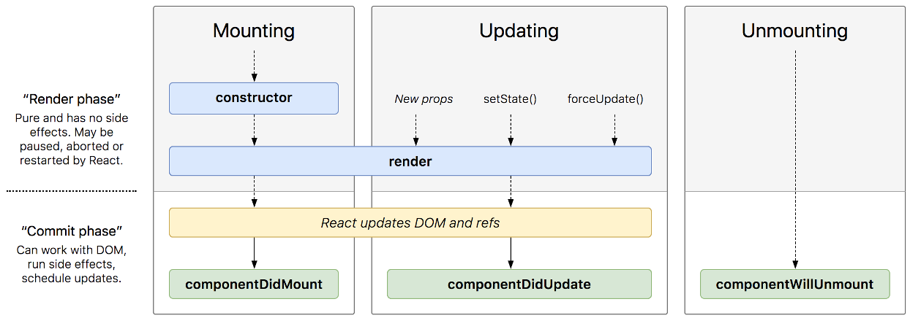
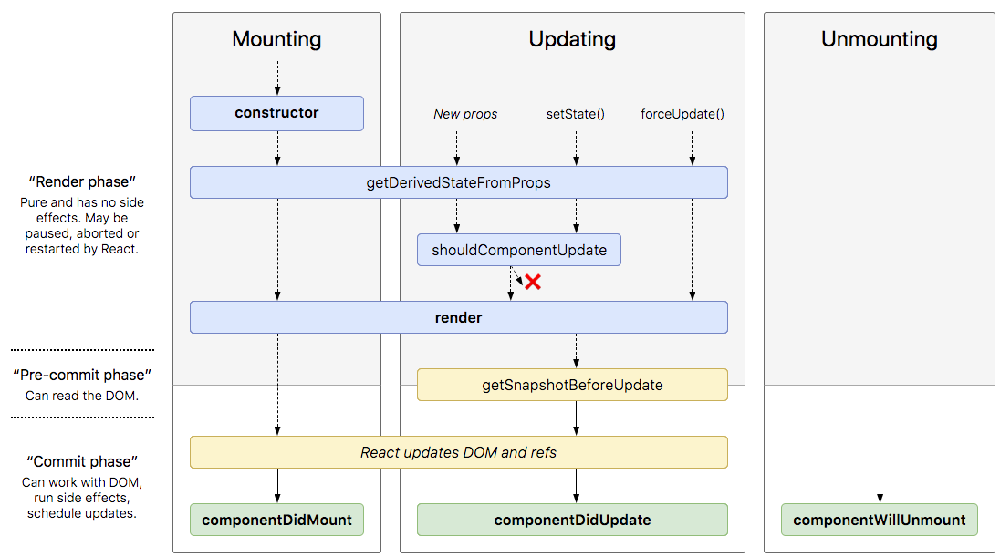
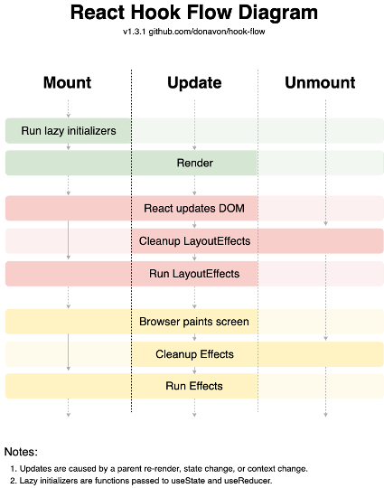

# Working with External Data - Part 1

## All Outcomes

- To understand component lifecycles
- To be able to understand different hooks available in React
- To be able to use the `useEffect` hook
- To understand what HTTP Verbs are used in RESTful services
- To be able to set up a mock RESTful service
- To be able to get data from an external service
- To be able to send data to an external service

## Contents

- Working with Data:
  - Problems persisting data
  - Component Lifecycles
  - React v16.8 - The One With Hooks

---

## Problems with Persisting Data

- Refreshing the application in the browser will destroy any data created during its life
- Persisting data requires a temporary or permanent store
  - __LocalStorage__ could be leveraged at a client level to store data
    - Can be removed by the client
    - Does not allow for server level data to be persisted
  - Usual for applications to request from or send to some form of data service
    - Make HTTP requests for data
    - Handle data when it is received
      - Causes chicken and egg situation for requesting and rendering
        - Need to understand component lifecycles and when hooks run

---

## Simple Lifecycle for Class Components


Image by Dan Abramov: (https://twitter.com/dan_abramov/)


## Complete Lifecycle for Class Components


Image by Dan Abramov: (https://twitter.com/dan_abramov/status/981712092611989509/photo/1)

## Lifecycle of a Function Component with Hooks



---

## React v16.8 *The One with Hooks*

### Why Hooks?

- Move to promote Functional Components needed mechanism for State and other React features
- Backwards compatible
- Lets you *‘hook into’* React’s state and lifecycle features
- Solve a raft of problems encountered by the React team:
  - Reuse of stateful logic between components
  - Splitting of complex components into smaller functions based on relationship
- Simplifies syntax of class components to functions 
  - classes have to be transpiled anyway

### State Hook Revistited...

- Allows addition of local state to a function component
- Requires `useState` to be used \(this is the HOOK\)
- Takes an argument of the initial state
- Returns the current state and a function to update it
  - Similar to __`this.setState`__ in a `class`
  - Calling the setting function causes a re-render of the component
- Can have *more than one* state hook in a component

```jsx
import { useState } from "react";

const ExampleWithManyStates = () => {
      // Declare state variables as needed
  const [name, setName] = useState(``);
  const [count, setCount] = useState(10);
  const [myObj, setMyObj] = useState({ myKey1: `myVal1`, myKey2: true});
  //…
```

>Detailed documentation: (https://reactjs.org/docs/hooks-reference.html#usestate)

---

## Types of hook

### The Effect Hook

- Replacment for __`ComponentDidMount`__ \, __`ComponentDidUpdate`__ and __`ComponentWillUnmount`__ class lifecycle methods
- Used to perform side effects on components
- Fetching data\, subscriptions or manually changing DOM from React components
- Runs after React flushes changes to DOM – after every render\, including the first
- Declared inside component so have access to __props__ and __state__
- Perform clean\-up by adding a __return__  __callback__ function
- Can have more than one __effect__ hook in a Component
- Optionally takes a second argument of an array of dependencies to help decide if the effect should run

```jsx
import { useState, useEffect } from "react";

const Counter = () => {
    const [count, setCount] = useState(0);
  
    useEffect(() => {
        // Replaces to CDM and CDU
        document.title = `Clicked {count} times`;
        // Replaces CWU
        return(() => console.log(`Final: ${count}`));
    });
  
    return (
        <>
            <p>You have clicked the button {count} times</p>
            <button onClick={()=>setCount(++count)}>
                Click Me!
            </button>
        </>
    );
};

export default Counter;
```

### Other Hooks

The documentation for Hooks provides several other flavours of Hooks (not discussed in detail here):

- `useContext`
- `useReducer`
- `useCallback`
- `useMemo`
- `useRef`
- `useImperativeHandle`
- `useLayoutEffect`
- `useDebugValue`

---

## Activity 15 -- External Data -- Using `useEffect`

### Outcomes

-   To be able to use the useEffect hook

### Overview

In this activity, you will transfer the initial setting of state from the **useState** call to a call on **useEffect**. Although functionally, this will not add anything to the application, it is a starting point to transferring the obtaining of data from a static file import to a call to an external service. The **useEffect** hook needs to be imported and then implemented, simply calling **setTodos** with the imported **sampleTodo** array.

You should use the **ExternalData/starter** folder for this activity, remembering to run an **npm install** before starting.

### Action 1

1.  Open **App.js** for editing.
2.  Add `useEffect` to the list of imports from **React** (it should be placed inside the **`{}`**).
3.  Change the value of the `useState` call in the Component to an ***empty array***.
4.  Add a call to `useEffect` -- it takes an *arrow function* that executes a call to `setTodos` using the `sampleTodos` as the value for a **key** of `todos` in ***object***.
5.  Use an empty array (`[]`) as the second argument to `useEffect`.
6.  Save the file and run the application.

> The app will load the `todos` when available but not yet allow adding.

---

[&lt;-- Previous - 8. Thinking In React Part 5 ](./8-ThinkingInReactPart5.md) | [Next - 10 - Working with External Data Part 2 --&gt;](./10-WorkingWithExternalDataPart2.md)
