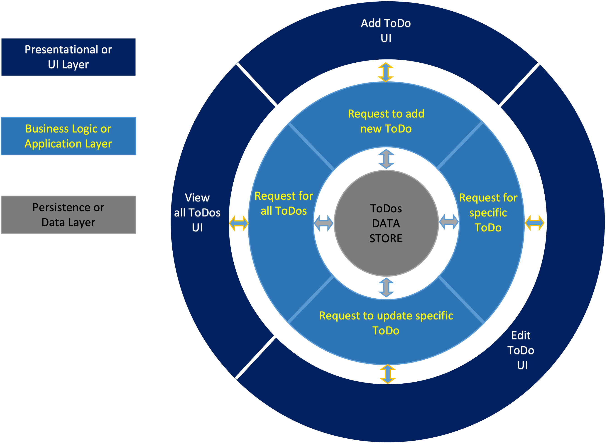
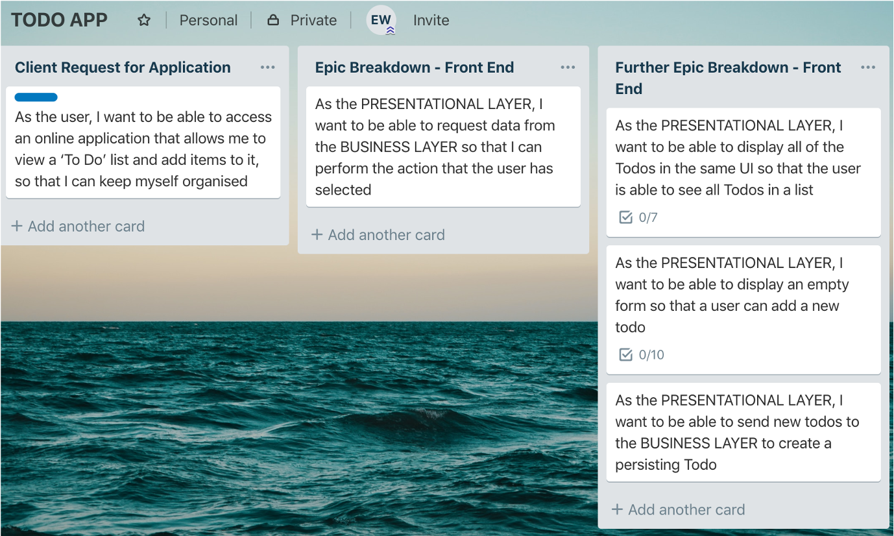

# Building Web Applications using React

## Outcomes

**By the end of the course, you will be able to:**

- Create React Components
- Perform some simple tests
- Think in React
- Add state and props to an application
- Add inverse data flow to an application
- Use some common React Hooks
- Use external services to provide data
- Set up a single page application

## Overview of an Application Requirement

> As a *user*, 
> I want to be able to *access an online application that allows me to view, add and edit a ‘To Do’ list*, 
>so that *I can keep myself organised*

### DISCUSSION:

How should the ‘team’ go about creating a solution for this request?

What architecture structure would it take?

---

## Classic N-Tier Architecture

N\-Tier Architecture is the idea that the application is split into distinct areas of code running on different computers

- Makes applications more maintainable and upgradable
- Makes code more reusable

---

## Epic Breakdown

> As a *user*, 
> I want to be able to *access an online application that allows me to view, add and edit a ‘To Do’ list*, 
>so that *I can keep myself organised*

### Presentational Stories

> As the __PRESENTATIONAL LAYER__ \, 
> I want to be able to _request data_  _from_ or _send data to_ the __BUSINESS LAYER__ br>
> so that _I can perform the action that the user has selected_

### DISCUSSION:

What needs to be done to produce a solution for this story?

Is it still a bit of an epic?

### Further Epic Breakdown

Further refinement may yield 3 user stories

They will have some common dependencies such as requiring common headers and footers for each view:

---

## Front End Development Options

|           | 'Vanilla' Development                                       | JavaScript Libraries                                                         | JavaScript Frameworks                                                    |
| --------- | ----------------------------------------------------------- | ---------------------------------------------------------------------------- | ------------------------------------------------------------------------ |
| TECHNIQUE | Use HTML, CSS and JavaScript to create the user interface   | Use a JavaScript library to build and create the user interface E.g. ReactJS | Use a JavaScript framework to create the user interface E.g. Angular     |
|           |                                                             |                                                                              |                                                                          |
| PROS      | - No specialist knowledge of libraries or frameworks needed | - Fast user interface                                                        | - Built-in features and functionality                                    |
|           |                                                             | - Reusable code                                                              | - Reusable code                                                          |
|           |                                                             | - Can create single page applications                                        | Can create single page applications                                      |
|           |                                                             | - Only extract parts of library that are needed                              |                                                                          |
|           |                                                             |                                                                              |                                                                          |
| CONS      | - Duplication of code to create multiple pages              | - Requires specialist knowledge to use effectively                           | - Requires specialist knowledge to use effectively                       |
|           | - Higher maintenance costs                                  | - Unable to perform ‘business logic’ actions within the application          | - Restrictive rules of the framework                                     |
|           |                                                             |                                                                              | - Can create large overheads for download as whole framework is included |
 
---

Next: [Introduction to ReactJS](./1-IntroductionToReactJS.md)
"# learnReactJS" 
